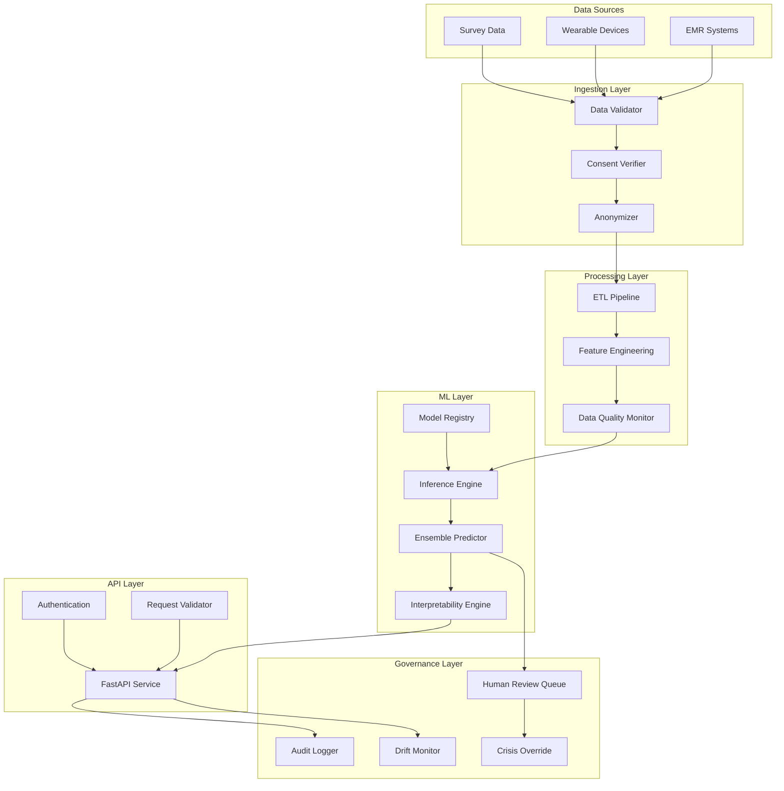

# Mental Health Risk Assessment System - Design Document

## Overview

The Mental Health Risk Assessment System (MHRAS) is a production-grade ML platform that ingests multi-modal health data, generates risk predictions, and provides interpretable recommendations to clinicians. The system prioritizes privacy, fairness, and clinical utility while maintaining sub-5-second response times for screening requests.

The architecture follows a modular design with clear separation between data ingestion, feature engineering, model inference, and API layers. All components are designed for horizontal scalability and include comprehensive monitoring and governance controls.

## Architecture

### High-Level Architecture



### Component Architecture

The system is organized into six primary layers:

1. **Ingestion Layer**: Validates schemas, verifies consent, and anonymizes data
2. **Processing Layer**: Cleans, transforms, and engineers features from raw data
3. **ML Layer**: Manages models, generates predictions, and provides explanations
4. **API Layer**: Exposes REST endpoints with authentication and validation
5. **Governance Layer**: Ensures compliance, monitors drift, and enables human oversight
6. **Storage Layer**: Persists data, models, and audit logs

## Components and Interfaces

### 1. Data Ingestion Components

#### DataValidator
**Purpose**: Validate incoming data against predefined schemas

**Interface**:
```python
class DataValidator:
    def validate_survey(self, data: Dict) -> ValidationResult
    def validate_wearable(self, data: Dict) -> ValidationResult
    def validate_emr(self, data: Dict) -> ValidationResult
    def get_schema(self, source_type: str) -> Schema
```

**Key Responsibilities**:
- Load and cache JSON schemas for each data source type
- Validate required fields, data types, and value ranges
- Return detailed error messages for validation failures
- Complete validation within 100ms per record

#### ConsentVerifier
**Purpose**: Verify that valid consent exists before processing data

**Interface**:
```python
class ConsentVerifier:
    def verify_consent(self, anonymized_id: str, data_types: List[str]) -> ConsentStatus
    def get_consent_expiry(self, anonymized_id: str) -> datetime
```

**Key Responsibilities**:
- Query consent database using anonymized identifiers
- Check consent validity for specific data types
- Handle consent expiration and revocation
- Cache consent status for performance

#### Anonymizer
**Purpose**: Remove PII and replace with cryptographic hashes

**Interface**:
```python
class Anonymizer:
    def anonymize_record(self, data: Dict, pii_fields: List[str]) -> Dict
    def hash_identifier(self, identifier: str) -> str
    def anonymize_text(self, text: str) -> str
```

**Key Responsibilities**:
- Apply SHA-256 hashing to identifiers with salt
- Redact or generalize PII in text fields
- Maintain consistency of hashes across records
- Preserve data utility while ensuring privacy

### 2. ETL Pipeline Components

#### DataCleaner
**Purpose**: Remove duplicates and handle data quality issues

**Interface**:
```python
class DataCleaner:
    def remove_duplicates(self, df: DataFrame) -> DataFrame
    def detect_outliers(self, df: DataFrame, columns: List[str]) -> DataFrame
    def handle_invalid_values(self, df: DataFrame) -> DataFrame
```

**Key Responsibilities**:
- Identify duplicates using anonymized ID and timestamp
- Flag statistical outliers using IQR or domain rules
- Replace invalid values with NaN for imputation
- Process 1000 records in under 10 seconds

#### Imputer
**Purpose**: Fill missing values using domain-specific strategies

**Interface**:
```python
class Imputer:
    def impute_missing(self, df: DataFrame, config: ImputationConfig) -> DataFrame
    def forward_fill_timeseries(self, df: DataFrame, columns: List[str]) -> DataFrame
    def impute_with_median(self, df: DataFrame, columns: List[str]) -> DataFrame
```

**Key Responsibilities**:
- Apply forward-fill for time-series continuity
- Use median imputation for physiological metrics
- Apply mode imputation for categorical variables
- Track imputation statistics for monitoring

#### Encoder
**Purpose**: Transform categorical variables for ML models

**Interface**:
```python
class Encoder:
    def target_encode(self, df: DataFrame, columns: List[str], target: str) -> DataFrame
    def one_hot_encode(self, df: DataFrame, columns: List[str]) -> DataFrame
    def ordinal_encode(self, df: DataFrame, columns: List[str], ordering: Dict) -> DataFrame
```

**Key Responsibilities**:
- Apply target encoding with smoothing to prevent overfitting
- Use one-hot encoding for low-cardinality categoricals
- Apply ordinal encoding for ordered categories
- Store encoding mappings for inference

#### Normalizer
**Purpose**: Scale numerical features for model input

**Interface**:
```python
class Normalizer:
    def normalize_timeseries(self, df: DataFrame, columns: List[str]) -> DataFrame
    def standardize_features(self, df: DataFrame, columns: List[str]) -> DataFrame
    def min_max_scale(self, df: DataFrame, columns: List[str]) -> DataFrame
```

**Key Responsibilities**:
- Standardize to zero mean and unit variance per individual
- Apply min-max scaling for bounded features
- Handle time-series normalization with rolling windows
- Persist scaling parameters for inference

### 3. Feature Engineering Components

#### BehavioralFeatureExtractor
**Purpose**: Compute behavioral aggregates from activity data

**Interface**:
```python
class BehavioralFeatureExtractor:
    def extract_activity_features(self, df: DataFrame) -> DataFrame
    def compute_routine_consistency(self, df: DataFrame) -> DataFrame
    def calculate_social_interaction_metrics(self, df: DataFrame) -> DataFrame
```

**Key Responsibilities**:
- Aggregate activity counts over 7-day and 30-day windows
- Calculate routine consistency using entropy measures
- Extract social interaction frequency and duration
- Generate features within 2 seconds per individual

#### SentimentAnalyzer
**Purpose**: Extract sentiment scores from text responses

**Interface**:
```python
class SentimentAnalyzer:
    def analyze_sentiment(self, text: str) -> SentimentScore
    def extract_emotion_scores(self, text: str) -> Dict[str, float]
    def detect_crisis_keywords(self, text: str) -> List[str]
```

**Key Responsibilities**:
- Apply pre-trained sentiment models (e.g., BERT-based)
- Generate valence, arousal, and dominance scores
- Flag crisis-related keywords for immediate review
- Process text in under 500ms per response

#### PhysiologicalFeatureExtractor
**Purpose**: Derive sleep and HRV metrics from wearable data

**Interface**:
```python
class PhysiologicalFeatureExtractor:
    def extract_sleep_features(self, df: DataFrame) -> DataFrame
    def compute_hrv_metrics(self, df: DataFrame) -> DataFrame
    def calculate_activity_intensity(self, df: DataFrame) -> DataFrame
```

**Key Responsibilities**:
- Calculate sleep duration, efficiency, and interruption counts
- Compute HRV metrics: RMSSD, SDNN, LF/HF ratio
- Derive activity intensity zones from heart rate
- Handle missing wearable data gracefully

#### AdherenceTracker
**Purpose**: Create therapy adherence flags

**Interface**:
```python
class AdherenceTracker:
    def calculate_adherence_rate(self, df: DataFrame) -> DataFrame
    def flag_missed_sessions(self, df: DataFrame) -> DataFrame
    def compute_engagement_score(self, df: DataFrame) -> DataFrame
```

**Key Responsibilities**:
- Track completion rates for prescribed interventions
- Flag patterns of missed appointments or sessions
- Calculate engagement scores from interaction logs
- Generate adherence features for model input

### 4. ML Components

#### ModelRegistry
**Purpose**: Manage model versions and metadata

**Interface**:
```python
class ModelRegistry:
    def register_model(self, model: Model, metadata: Dict) -> str
    def load_model(self, model_id: str) -> Model
    def get_active_models(self) -> List[Model]
    def retire_model(self, model_id: str) -> None
```

**Key Responsibilities**:
- Store models with versioning and metadata
- Track model performance metrics over time
- Enable A/B testing of model versions
- Support model rollback for production issues

#### InferenceEngine
**Purpose**: Generate predictions from individual models

**Interface**:
```python
class InferenceEngine:
    def predict_baseline(self, features: DataFrame) -> Predictions
    def predict_temporal(self, features: DataFrame) -> Predictions
    def detect_anomalies(self, features: DataFrame) -> AnomalyScores
```

**Key Responsibilities**:
- Load models from registry on initialization
- Execute inference with batching for efficiency
- Handle model-specific preprocessing
- Complete inference within 2 seconds

#### EnsemblePredictor
**Purpose**: Combine predictions from multiple models

**Interface**:
```python
class EnsemblePredictor:
    def ensemble_predictions(self, predictions: List[Predictions]) -> RiskScore
    def calculate_confidence(self, predictions: List[Predictions]) -> float
    def classify_risk_level(self, risk_score: float) -> RiskLevel
```

**Key Responsibilities**:
- Apply weighted averaging based on validation performance
- Calculate prediction confidence from model agreement
- Map continuous scores to risk categories
- Trigger alerts for critical risk levels

#### InterpretabilityEngine
**Purpose**: Generate explanations for predictions

**Interface**:
```python
class InterpretabilityEngine:
    def compute_shap_values(self, model: Model, features: DataFrame) -> ShapValues
    def generate_counterfactuals(self, features: DataFrame, target_class: str) -> Counterfactuals
    def extract_rule_set(self, model: Model) -> RuleSet
```

**Key Responsibilities**:
- Calculate SHAP values for top 10 features
- Generate minimal counterfactual explanations
- Extract interpretable rule approximations
- Format explanations in clinical language

### 5. API Components

#### FastAPIService
**Purpose**: Expose REST endpoints for screening requests

**Interface**:
```python
@app.post("/screen")
async def screen_individual(request: ScreeningRequest) -> ScreeningResponse

@app.get("/risk-score/{anonymized_id}")
async def get_risk_score(anonymized_id: str) -> RiskScoreResponse

@app.post("/explain")
async def explain_prediction(request: ExplanationRequest) -> ExplanationResponse
```

**Key Responsibilities**:
- Handle HTTP requests with async processing
- Validate requests using Pydantic models
- Coordinate calls to ingestion, ML, and governance layers
- Return responses within 5 seconds

#### Authenticator
**Purpose**: Verify API request authentication

**Interface**:
```python
class Authenticator:
    def verify_token(self, token: str) -> AuthResult
    def generate_token(self, user_id: str, expiry: int) -> str
    def revoke_token(self, token: str) -> None
```

**Key Responsibilities**:
- Validate JWT tokens with signature verification
- Check token expiration and revocation status
- Support role-based access control
- Cache authentication results for performance

### 6. Governance Components

#### AuditLogger
**Purpose**: Log all system activities for compliance

**Interface**:
```python
class AuditLogger:
    def log_screening_request(self, request: Dict, response: Dict) -> None
    def log_prediction(self, features_hash: str, prediction: Dict, model_id: str) -> None
    def log_human_review(self, case_id: str, reviewer: str, decision: str) -> None
    def generate_audit_report(self, start_date: datetime, end_date: datetime) -> Report
```

**Key Responsibilities**:
- Write structured logs in JSON format
- Include timestamps, user IDs, and data hashes
- Support log aggregation and querying
- Generate weekly compliance reports

#### DriftMonitor
**Purpose**: Detect changes in data distributions

**Interface**:
```python
class DriftMonitor:
    def detect_feature_drift(self, current_data: DataFrame, reference_data: DataFrame) -> DriftReport
    def detect_prediction_drift(self, predictions: List[float]) -> DriftReport
    def alert_on_drift(self, drift_score: float, threshold: float) -> None
```

**Key Responsibilities**:
- Compare distributions using KL divergence or KS tests
- Track prediction distribution shifts over time
- Alert when drift exceeds configured thresholds
- Trigger model retraining workflows

#### HumanReviewQueue
**Purpose**: Route high-risk cases to clinicians

**Interface**:
```python
class HumanReviewQueue:
    def enqueue_case(self, case: ReviewCase) -> str
    def get_pending_cases(self, reviewer_id: str) -> List[ReviewCase]
    def submit_review(self, case_id: str, decision: ReviewDecision) -> None
```

**Key Responsibilities**:
- Queue cases with risk scores above 75
- Assign cases to available reviewers
- Track review completion and decisions
- Escalate overdue reviews

#### CrisisOverride
**Purpose**: Enable emergency bypasses of system workflows

**Interface**:
```python
class CrisisOverride:
    def initiate_override(self, case_id: str, clinician_id: str, reason: str) -> None
    def get_override_history(self, case_id: str) -> List[Override]
```

**Key Responsibilities**:
- Allow clinicians to bypass automated recommendations
- Log all override actions with justifications
- Notify supervisors of override usage
- Support post-hoc review of overrides

## Data Models

### Core Data Structures

#### ScreeningRequest
```python
class ScreeningRequest(BaseModel):
    anonymized_id: str
    survey_data: Optional[Dict]
    wearable_data: Optional[Dict]
    emr_data: Optional[Dict]
    consent_verified: bool
    timestamp: datetime
```

#### RiskScore
```python
class RiskScore(BaseModel):
    anonymized_id: str
    score: float  # 0-100
    risk_level: RiskLevel  # LOW, MODERATE, HIGH, CRITICAL
    confidence: float  # 0-1
    contributing_factors: List[str]
    timestamp: datetime
```

#### ScreeningResponse
```python
class ScreeningResponse(BaseModel):
    risk_score: RiskScore
    recommendations: List[ResourceRecommendation]
    explanations: ExplanationSummary
    requires_human_review: bool
    alert_triggered: bool
```

#### ExplanationSummary
```python
class ExplanationSummary(BaseModel):
    top_features: List[Tuple[str, float]]  # (feature_name, shap_value)
    counterfactual: str  # Human-readable description
    rule_approximation: str  # Simple if-then rules
    clinical_interpretation: str
```

### Database Schema

#### predictions_table
```sql
CREATE TABLE predictions (
    id UUID PRIMARY KEY,
    anonymized_id VARCHAR(64) NOT NULL,
    risk_score FLOAT NOT NULL,
    risk_level VARCHAR(20) NOT NULL,
    confidence FLOAT NOT NULL,
    model_version VARCHAR(50) NOT NULL,
    features_hash VARCHAR(64) NOT NULL,
    created_at TIMESTAMP NOT NULL,
    INDEX idx_anonymized_id (anonymized_id),
    INDEX idx_created_at (created_at)
);
```

#### audit_log_table
```sql
CREATE TABLE audit_log (
    id UUID PRIMARY KEY,
    event_type VARCHAR(50) NOT NULL,
    anonymized_id VARCHAR(64),
    user_id VARCHAR(64),
    details JSONB NOT NULL,
    created_at TIMESTAMP NOT NULL,
    INDEX idx_event_type (event_type),
    INDEX idx_created_at (created_at)
);
```

#### consent_table
```sql
CREATE TABLE consent (
    anonymized_id VARCHAR(64) PRIMARY KEY,
    data_types TEXT[] NOT NULL,
    granted_at TIMESTAMP NOT NULL,
    expires_at TIMESTAMP,
    revoked_at TIMESTAMP,
    INDEX idx_expires_at (expires_at)
);
```

#### human_review_queue_table
```sql
CREATE TABLE human_review_queue (
    case_id UUID PRIMARY KEY,
    anonymized_id VARCHAR(64) NOT NULL,
    risk_score FLOAT NOT NULL,
    assigned_to VARCHAR(64),
    status VARCHAR(20) NOT NULL,
    decision VARCHAR(20),
    created_at TIMESTAMP NOT NULL,
    reviewed_at TIMESTAMP,
    INDEX idx_status (status),
    INDEX idx_assigned_to (assigned_to)
);
```

## Error Handling

### Error Categories

1. **Validation Errors**: Invalid input data or schema violations
   - Return 400 Bad Request with detailed error messages
   - Log validation failures for monitoring
   - Do not process invalid data

2. **Authentication Errors**: Invalid or expired tokens
   - Return 401 Unauthorized
   - Log authentication attempts
   - Rate limit failed attempts

3. **Consent Errors**: Missing or expired consent
   - Return 403 Forbidden
   - Log consent violations
   - Do not process data without consent

4. **Processing Errors**: Failures in ETL or feature engineering
   - Return 500 Internal Server Error
   - Log full stack traces
   - Alert on-call engineers

5. **Model Errors**: Inference failures or missing models
   - Return 503 Service Unavailable
   - Fall back to baseline models if available
   - Alert ML team

6. **Timeout Errors**: Operations exceeding time limits
   - Return 504 Gateway Timeout
   - Log slow operations
   - Trigger performance investigation

### Error Recovery Strategies

- **Retry Logic**: Retry transient failures up to 3 times with exponential backoff
- **Circuit Breaker**: Disable failing components after 5 consecutive failures
- **Graceful Degradation**: Return partial results when non-critical components fail
- **Fallback Models**: Use simpler baseline models if complex models fail
- **Manual Override**: Allow clinicians to bypass system errors in emergencies

### Error Logging

All errors are logged with structured format:
```json
{
  "timestamp": "2025-11-17T10:30:00Z",
  "level": "ERROR",
  "component": "InferenceEngine",
  "error_type": "ModelLoadError",
  "message": "Failed to load model version 1.2.3",
  "stack_trace": "...",
  "context": {
    "model_id": "lgbm_v1.2.3",
    "request_id": "req_abc123"
  }
}
```

## Testing Strategy

### Unit Testing

**Scope**: Individual components and functions

**Approach**:
- Test each component interface with valid and invalid inputs
- Mock external dependencies (databases, APIs, models)
- Achieve 80% code coverage minimum
- Use pytest framework with fixtures

**Key Test Cases**:
- DataValidator: Test schema validation with valid/invalid data
- Anonymizer: Verify hash consistency and PII removal
- Imputer: Test imputation strategies with various missing patterns
- InferenceEngine: Test prediction generation with mock models
- Authenticator: Test token validation and expiration

### Integration Testing

**Scope**: Component interactions and data flow

**Approach**:
- Test end-to-end workflows from API to response
- Use test databases and model artifacts
- Verify data transformations across pipeline stages
- Test error propagation and recovery

**Key Test Cases**:
- Full screening workflow: API request → ingestion → ETL → inference → response
- Consent verification: Reject data without valid consent
- Human review routing: High-risk cases enqueued correctly
- Drift detection: Alert triggered when distribution shifts
- Crisis override: Emergency workflow bypasses normal process

### Performance Testing

**Scope**: Response times and throughput

**Approach**:
- Load test API endpoints with realistic request volumes
- Measure p50, p95, p99 latencies
- Test with concurrent requests (100+ simultaneous)
- Profile bottlenecks using cProfile

**Performance Targets**:
- Screening request: < 5 seconds end-to-end
- Schema validation: < 100ms per record
- Feature engineering: < 2 seconds per individual
- Model inference: < 2 seconds for ensemble
- Explanation generation: < 3 seconds

### Fairness Testing

**Scope**: Model equity across demographic groups

**Approach**:
- Compute performance metrics stratified by demographics
- Test for disparate impact using 80% rule
- Verify calibration across subgroups
- Audit feature importance for protected attributes

**Fairness Metrics**:
- AUROC difference < 0.05 across groups
- False positive rate parity within 10%
- Calibration error < 0.05 per group
- No protected attributes in top 10 SHAP features

### Security Testing

**Scope**: Authentication, authorization, and data protection

**Approach**:
- Penetration testing of API endpoints
- Test authentication bypass attempts
- Verify PII anonymization effectiveness
- Test SQL injection and XSS vulnerabilities

**Security Checks**:
- Token validation prevents unauthorized access
- Anonymization is irreversible
- No PII in logs or error messages
- Rate limiting prevents abuse
- HTTPS enforced for all communications

## Deployment Architecture

### Infrastructure

- **API Service**: FastAPI application running on Kubernetes
  - 3+ replicas for high availability
  - Auto-scaling based on CPU and request rate
  - Health checks and readiness probes

- **Database**: PostgreSQL for structured data
  - Primary-replica setup for read scaling
  - Automated backups every 6 hours
  - Point-in-time recovery enabled

- **Model Storage**: S3-compatible object storage
  - Versioned model artifacts
  - Encrypted at rest
  - Lifecycle policies for old versions

- **Logging**: Centralized logging with ELK stack
  - Structured JSON logs
  - Retention: 90 days
  - Alerting on error patterns

- **Monitoring**: Prometheus + Grafana
  - Request latency metrics
  - Model performance metrics
  - Drift detection alerts
  - Resource utilization dashboards

### Deployment Process

1. **Build**: Package application and dependencies into Docker image
2. **Test**: Run full test suite in CI/CD pipeline
3. **Stage**: Deploy to staging environment for validation
4. **Canary**: Deploy to 10% of production traffic
5. **Monitor**: Observe metrics for 1 hour
6. **Rollout**: Gradually increase to 100% if metrics are healthy
7. **Rollback**: Automatic rollback if error rate exceeds threshold

### Configuration Management

- Environment-specific configs in Kubernetes ConfigMaps
- Secrets (API keys, DB passwords) in Kubernetes Secrets
- Feature flags for gradual rollout of new features
- Model version selection via configuration

## Monitoring and Observability

### Key Metrics

**Application Metrics**:
- Request rate (requests/second)
- Response latency (p50, p95, p99)
- Error rate by error type
- Active connections

**ML Metrics**:
- Prediction distribution (risk score histogram)
- Model inference latency
- Feature drift scores
- Prediction drift scores
- Model agreement (ensemble variance)

**Business Metrics**:
- Screening requests per day
- High-risk cases identified
- Human review queue length
- Crisis overrides per week
- Resource recommendation acceptance rate

### Alerting Rules

- **Critical**: Response latency > 10 seconds for 5 minutes
- **Critical**: Error rate > 5% for 5 minutes
- **Warning**: Feature drift score > 0.3
- **Warning**: Human review queue > 50 cases
- **Info**: Model performance degradation > 5%

### Dashboards

1. **Operations Dashboard**: Request rates, latencies, errors
2. **ML Dashboard**: Model performance, drift, predictions
3. **Clinical Dashboard**: Risk score distributions, review queue
4. **Compliance Dashboard**: Audit log summaries, consent status

## Data Lineage and Governance

### Data Lineage Tracking

Each prediction includes lineage metadata:
- Source data identifiers (anonymized)
- Data ingestion timestamp
- ETL pipeline version
- Feature engineering version
- Model version and ensemble weights
- Prediction timestamp

Lineage is stored in audit logs and queryable for investigations.

### Consent Management

- Consent verified before any data processing
- Consent types: survey, wearable, EMR
- Consent can be granular (specific data types)
- Consent expiration and revocation supported
- Audit trail of all consent changes

### Human-in-the-Loop Workflows

**Trigger Conditions**:
- Risk score > 75 (critical level)
- Model confidence < 0.6
- Anomaly detection flags unusual pattern
- Manual review requested by clinician

**Review Process**:
1. Case added to review queue with priority
2. Assigned to available clinician
3. Clinician reviews data, prediction, and explanation
4. Clinician confirms, modifies, or overrides prediction
5. Decision logged with justification
6. Patient notified of outcome

**Escalation**:
- Cases not reviewed within 4 hours escalated to supervisor
- Critical cases (score > 90) escalated immediately

### Crisis Override Protocol

**When to Use**:
- Immediate safety concern
- System unavailable or malfunctioning
- Clinical judgment contradicts system recommendation

**Process**:
1. Clinician initiates override with case ID
2. System prompts for reason and justification
3. Override logged with full context
4. Supervisor notified immediately
5. Case flagged for post-hoc review
6. Override statistics tracked for quality assurance

**Audit**:
- All overrides reviewed monthly
- Patterns analyzed for system improvements
- Excessive overrides trigger model review

## Security and Privacy

### Data Protection

- All PII anonymized using SHA-256 with salt
- Anonymization keys stored separately with restricted access
- Data encrypted at rest (AES-256)
- Data encrypted in transit (TLS 1.3)
- No PII in logs, error messages, or monitoring

### Access Control

- Role-based access control (RBAC)
- Roles: Admin, Clinician, Data Scientist, Auditor
- Principle of least privilege
- Access logs for all data queries
- Regular access reviews

### Compliance

- HIPAA compliance for health data
- GDPR compliance for EU users
- Regular security audits
- Penetration testing quarterly
- Incident response plan documented

## Future Enhancements

### Phase 2 Considerations

- Real-time streaming data ingestion
- Federated learning for multi-site deployments
- Mobile app for patient self-screening
- Integration with telehealth platforms
- Multilingual support for global deployment
- Advanced temporal models (Transformers)
- Causal inference for intervention recommendations
- Automated model retraining pipelines
