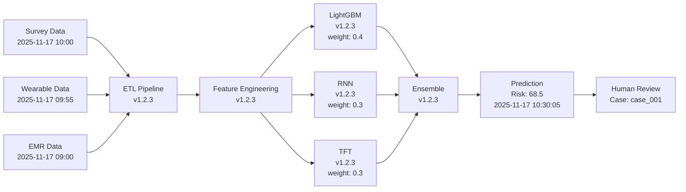

# MHRAS Governance Documentation

This comprehensive guide covers the governance framework for the Mental Health Risk Assessment System (MHRAS), including data lineage tracking, consent management workflows, human-in-the-loop processes, and crisis override protocols.

## Table of Contents

1. [Overview](#overview)
2. [Data Lineage Tracking](#data-lineage-tracking)
3. [Consent Management Workflows](#consent-management-workflows)
4. [Human-in-the-Loop Processes](#human-in-the-loop-processes)
5. [Crisis Override Protocols](#crisis-override-protocols)
6. [Audit Logging](#audit-logging)
7. [Drift Monitoring](#drift-monitoring)
8. [Compliance and Reporting](#compliance-and-reporting)
9. [Best Practices](#best-practices)

## Overview

The MHRAS governance framework ensures:

- **Transparency**: Complete audit trail of all system activities
- **Accountability**: Clear responsibility for decisions and actions
- **Privacy**: PII protection through anonymization and consent management
- **Safety**: Human oversight for high-risk cases
- **Compliance**: HIPAA, GDPR, and regulatory requirements
- **Quality**: Continuous monitoring of model performance and data quality

### Governance Components

| Component | Purpose | Requirements |
|-----------|---------|--------------|
| **AuditLogger** | Logs all system activities | Requirement 1.5, 10.1, 10.5 |
| **ConsentVerifier** | Manages consent verification | Requirement 2.5, 10.2 |
| **Anonymizer** | Protects PII | Requirement 2.3 |
| **DriftMonitor** | Detects distribution changes | Requirement 9.3 |
| **HumanReviewQueue** | Manages high-risk case reviews | Requirement 1.3, 10.3 |
| **CrisisOverride** | Handles emergency workflows | Requirement 10.4 |

## Data Lineage Tracking

Data lineage provides complete traceability from source data to predictions, enabling:
- Root cause analysis of prediction errors
- Model debugging and improvement
- Regulatory compliance (21 CFR Part 11, HIPAA)
- Reproducibility of results

### Lineage Metadata

Every prediction includes comprehensive lineage information:

```python
{
  "prediction_id": "pred_20251117_103005_abc123",
  "anonymized_id": "a1b2c3d4e5f6789012345678",
  "timestamp": "2025-11-17T10:30:05Z",
  
  # Source Data Lineage
  "source_data": {
    "survey_data_id": "survey_20251117_100000",
    "wearable_data_id": "wearable_20251117_095500",
    "emr_data_id": "emr_20251117_090000",
    "data_ingestion_timestamp": "2025-11-17T10:00:00Z",
    "consent_verification_timestamp": "2025-11-17T10:00:01Z",
    "consent_status": "valid"
  },
  
  # Processing Lineage
  "processing": {
    "etl_pipeline_version": "1.2.3",
    "feature_engineering_version": "1.2.3",
    "data_quality_checks": {
      "validation_passed": true,
      "outliers_detected": 2,
      "missing_values_imputed": 5
    },
    "features_hash": "sha256:abc123def456...",
    "processing_timestamp": "2025-11-17T10:30:02Z"
  },
  
  # Model Lineage
  "model": {
    "ensemble_version": "1.2.3",
    "models_used": [
      {
        "model_id": "lgbm_v1.2.3",
        "model_type": "baseline",
        "training_date": "2025-11-01",
        "training_data_hash": "sha256:train123...",
        "weight": 0.4
      },
      {
        "model_id": "rnn_v1.2.3",
        "model_type": "temporal",
        "training_date": "2025-11-01",
        "training_data_hash": "sha256:train123...",
        "weight": 0.3
      },
      {
        "model_id": "tft_v1.2.3",
        "model_type": "temporal",
        "training_date": "2025-11-01",
        "training_data_hash": "sha256:train123...",
        "weight": 0.3
      }
    ],
    "inference_timestamp": "2025-11-17T10:30:04Z"
  },
  
  # Prediction Output
  "prediction": {
    "risk_score": 68.5,
    "risk_level": "high",
    "confidence": 0.85,
    "model_agreement": 0.92,
    "contributing_factors": [
      "Elevated PHQ-9 score",
      "Poor sleep quality"
    ]
  },
  
  # Governance
  "governance": {
    "requires_human_review": true,
    "alert_triggered": false,
    "review_case_id": "case_20251117_103005",
    "audit_log_id": "audit_20251117_103005"
  }
}
```

### Tracking Data Lineage

**Automatic Lineage Capture:**

```python
from src.governance import AuditLogger

audit_logger = AuditLogger()

# Lineage is automatically captured during screening
# Each component adds its lineage information

# Example: ETL Pipeline adds processing lineage
etl_result = etl_pipeline.process(data)
etl_result.lineage = {
    "pipeline_version": "1.2.3",
    "processing_timestamp": datetime.utcnow(),
    "features_hash": compute_hash(etl_result.features)
}

# Example: Model adds inference lineage
prediction = ensemble_predictor.predict(features)
prediction.lineage = {
    "models_used": ensemble_predictor.get_active_models(),
    "inference_timestamp": datetime.utcnow()
}

# All lineage is consolidated in audit log
audit_logger.log_prediction(
    features_hash=etl_result.lineage["features_hash"],
    prediction=prediction,
    model_id="ensemble_v1.2.3",
    anonymized_id=anonymized_id,
    lineage={
        "source_data": source_lineage,
        "processing": etl_result.lineage,
        "model": prediction.lineage
    }
)
```

### Querying Lineage

**Trace Prediction Back to Source:**

```python
# Get complete lineage for a prediction
lineage = audit_logger.get_prediction_lineage(
    prediction_id="pred_20251117_103005_abc123"
)

print(f"Source data IDs: {lineage['source_data']}")
print(f"ETL version: {lineage['processing']['etl_pipeline_version']}")
print(f"Models used: {[m['model_id'] for m in lineage['model']['models_used']]}")
print(f"Features hash: {lineage['processing']['features_hash']}")
```

**Find All Predictions Using a Model:**

```python
# Find predictions made with a specific model version
predictions = audit_logger.query_predictions_by_model(
    model_id="lgbm_v1.2.3",
    start_date=datetime(2025, 11, 1),
    end_date=datetime(2025, 11, 17)
)

print(f"Found {len(predictions)} predictions using lgbm_v1.2.3")
```

**Trace Data Quality Issues:**

```python
# Find predictions with data quality issues
problematic_predictions = audit_logger.query_predictions_by_quality(
    min_outliers=5,
    min_missing_values=10,
    start_date=datetime(2025, 11, 1)
)

for pred in problematic_predictions:
    print(f"Prediction {pred['prediction_id']}:")
    print(f"  Outliers: {pred['processing']['data_quality_checks']['outliers_detected']}")
    print(f"  Missing values: {pred['processing']['data_quality_checks']['missing_values_imputed']}")
```

### Lineage Visualization

**Generate Lineage Diagram:**

```python
# Generate visual lineage diagram for a prediction
from src.governance.lineage import generate_lineage_diagram

diagram = generate_lineage_diagram(
    prediction_id="pred_20251117_103005_abc123",
    output_format="mermaid"  # or "graphviz", "png"
)

print(diagram)
```

**Example Lineage Diagram:**



### Lineage Retention

**Retention Policy:**
- Prediction lineage: 7 years (HIPAA requirement)
- Model lineage: Indefinite (for reproducibility)
- Processing lineage: 3 years
- Source data references: 7 years

**Archival:**

```python
# Archive old lineage data
audit_logger.archive_lineage(
    before_date=datetime(2023, 1, 1),
    archive_location="s3://mhras-archives/lineage/"
)

# Retrieve archived lineage
archived_lineage = audit_logger.retrieve_archived_lineage(
    prediction_id="pred_20230115_120000_xyz789",
    archive_location="s3://mhras-archives/lineage/"
)
```

## Consent Management Workflows

Consent management ensures that all data processing complies with privacy regulations (HIPAA, GDPR) and respects individual autonomy.

### Consent Requirements

**Requirement 2.5, 10.2:** THE MHRAS SHALL verify consent status before ingesting any data source and reject data without valid consent.

**Consent Types:**
- **Survey Data**: Consent to process survey responses (PHQ-9, GAD-7, etc.)
- **Wearable Data**: Consent to process wearable device metrics
- **EMR Data**: Consent to access electronic medical records
- **Prediction Storage**: Consent to store risk predictions
- **Research Use**: Consent for de-identified data use in research

### Consent Data Model

```python
{
  "anonymized_id": "a1b2c3d4e5f6789012345678",
  "consent_id": "consent_20251117_100000",
  "data_types": ["survey", "wearable", "emr"],
  "granted_at": "2025-11-17T10:00:00Z",
  "granted_by": "individual_self",  # or "legal_guardian", "authorized_representative"
  "expires_at": "2026-11-17T10:00:00Z",  # 1 year default
  "revoked_at": null,
  "revocation_reason": null,
  "consent_version": "2.0",  # Consent form version
  "consent_document_id": "doc_consent_v2.0",
  "granular_permissions": {
    "allow_prediction_storage": true,
    "allow_research_use": false,
    "allow_data_sharing": false,
    "notification_preferences": ["email", "sms"]
  },
  "audit_trail": [
    {
      "action": "granted",
      "timestamp": "2025-11-17T10:00:00Z",
      "ip_address": "192.168.1.100",
      "user_agent": "Mozilla/5.0..."
    }
  ]
}
```

### Consent Verification Workflow

**Step 1: Check Consent Before Processing**

```python
from src.governance import ConsentVerifier

consent_verifier = ConsentVerifier()

# Verify consent before screening
consent_status = consent_verifier.verify_consent(
    anonymized_id="a1b2c3d4e5f6789012345678",
    data_types=["survey", "wearable", "emr"]
)

if not consent_status.is_valid:
    raise ConsentError(
        f"Consent verification failed: {consent_status.reason}"
    )

# Proceed with screening
```

**Step 2: Handle Consent Expiration**

```python
# Check if consent is expiring soon
expiring_consents = consent_verifier.get_expiring_consents(
    days_until_expiry=30
)

for consent in expiring_consents:
    # Send renewal notification
    send_consent_renewal_notification(
        anonymized_id=consent.anonymized_id,
        expires_at=consent.expires_at
    )
```

**Step 3: Handle Consent Revocation**

```python
# Individual revokes consent
consent_verifier.revoke_consent(
    anonymized_id="a1b2c3d4e5f6789012345678",
    revocation_reason="individual_request",
    revoked_by="individual_self"
)

# System automatically:
# 1. Stops all data processing for this individual
# 2. Logs revocation in audit trail
# 3. Optionally deletes data (based on policy)
```

### Granular Consent Management

**Partial Consent:**

```python
# Individual consents to survey and wearable, but not EMR
consent_verifier.grant_consent(
    anonymized_id="a1b2c3d4e5f6789012345678",
    data_types=["survey", "wearable"],  # EMR excluded
    expires_at=datetime.utcnow() + timedelta(days=365)
)

# Later, individual adds EMR consent
consent_verifier.update_consent(
    anonymized_id="a1b2c3d4e5f6789012345678",
    add_data_types=["emr"]
)
```

**Consent Modification:**

```python
# Individual modifies granular permissions
consent_verifier.update_consent_permissions(
    anonymized_id="a1b2c3d4e5f6789012345678",
    granular_permissions={
        "allow_prediction_storage": true,
        "allow_research_use": true,  # Changed from false
        "allow_data_sharing": false,
        "notification_preferences": ["email"]  # Removed SMS
    }
)
```

### Consent Audit Trail

**Track All Consent Actions:**

```python
# Get complete consent history
consent_history = consent_verifier.get_consent_history(
    anonymized_id="a1b2c3d4e5f6789012345678"
)

for event in consent_history:
    print(f"{event['timestamp']}: {event['action']}")
    print(f"  Data types: {event['data_types']}")
    print(f"  Granted by: {event['granted_by']}")
```

**Consent Compliance Report:**

```python
# Generate consent compliance report
report = consent_verifier.generate_compliance_report(
    start_date=datetime(2025, 11, 1),
    end_date=datetime(2025, 11, 17)
)

print(f"Total consents: {report['total_consents']}")
print(f"Active consents: {report['active_consents']}")
print(f"Expired consents: {report['expired_consents']}")
print(f"Revoked consents: {report['revoked_consents']}")
print(f"Expiring soon (30 days): {report['expiring_soon']}")
print(f"Consent verification failures: {report['verification_failures']}")
```

### GDPR Right to Erasure

**Data Deletion Workflow:**

```python
# Individual exercises right to erasure (GDPR Article 17)
consent_verifier.process_erasure_request(
    anonymized_id="a1b2c3d4e5f6789012345678",
    request_date=datetime.utcnow(),
    requester="individual_self"
)

# System performs:
# 1. Revoke all consents
# 2. Delete or anonymize all personal data
# 3. Remove from active databases
# 4. Archive audit logs (required for compliance)
# 5. Notify individual of completion
```

### Consent Form Versioning

**Track Consent Form Changes:**

```python
# When consent form is updated
consent_verifier.register_consent_form_version(
    version="3.0",
    effective_date=datetime(2025, 12, 1),
    changes_summary="Added research use consent option",
    requires_re_consent=True  # Existing consents need renewal
)

# Get individuals requiring re-consent
individuals_needing_reconsent = consent_verifier.get_individuals_needing_reconsent(
    new_version="3.0"
)

for individual in individuals_needing_reconsent:
    send_reconsent_request(individual.anonymized_id)
```

## Human-in-the-Loop Processes

Human-in-the-loop (HITL) ensures that high-risk or uncertain predictions are reviewed by qualified clinicians before final decisions are made.

### When Human Review is Required

**Requirement 1.3, 10.3:** THE MHRAS SHALL route predictions with risk scores above 75 to human-in-the-loop review queues.

**Automatic Triggers:**
1. **High Risk Score**: Risk score > 75 (critical level)
2. **Low Confidence**: Model confidence < 0.6
3. **Model Disagreement**: Ensemble models disagree significantly
4. **Anomaly Detection**: Unusual pattern detected
5. **Data Quality Issues**: Significant missing data or outliers
6. **Manual Request**: Clinician requests review

### Human Review Queue Workflow

**Step 1: Case Enqueued**

```python
from src.governance import HumanReviewQueue

review_queue = HumanReviewQueue()

# System automatically enqueues high-risk case
case_id = review_queue.enqueue_case(
    anonymized_id="a1b2c3d4e5f6789012345678",
    risk_score=82,
    risk_level="critical",
    prediction_data={
        "score": 82,
        "confidence": 0.87,
        "contributing_factors": [
            "Elevated PHQ-9 score (22/27)",
            "Severe sleep disruption (3.5 hours)",
            "Very low HRV (18 ms)",
            "Recent crisis keywords detected"
        ],
        "model_agreement": 0.95
    },
    features={
        "phq9_score": 22,
        "sleep_duration": 3.5,
        "hrv_rmssd": 18,
        "crisis_keywords": ["hopeless", "worthless"]
    },
    priority="urgent",  # urgent, high, normal
    reason="high_risk_score"
)

# Case is assigned priority based on:
# - Risk score (higher = more urgent)
# - Confidence (lower = more urgent)
# - Time since last screening
# - Historical patterns
```

**Step 2: Clinician Retrieves Cases**

```python
# Clinician logs in and retrieves pending cases
pending_cases = review_queue.get_pending_cases(
    reviewer_id="clinician_002",
    limit=10,
    priority_filter=["urgent", "high"]
)

for case in pending_cases:
    print(f"Case {case.case_id}:")
    print(f"  Risk Score: {case.risk_score}")
    print(f"  Priority: {case.priority}")
    print(f"  Time in Queue: {case.time_in_queue_hours:.1f} hours")
    print(f"  Contributing Factors: {case.prediction_data['contributing_factors']}")
```

**Step 3: Clinician Reviews Case**

```python
# Start reviewing a case
case = review_queue.start_review(
    case_id=case_id,
    reviewer_id="clinician_002"
)

# Clinician reviews:
# - Risk score and confidence
# - Contributing factors
# - Feature values
# - Model explanations (SHAP, counterfactuals)
# - Historical data (if available)
# - Clinical context

# Access additional context
historical_scores = get_historical_risk_scores(case.anonymized_id)
explanations = get_model_explanations(case.prediction_id)
```

**Step 4: Clinician Makes Decision**

```python
# Decision options:
# - CONFIRM: Agree with model prediction
# - MODIFY: Adjust risk score or level
# - OVERRIDE: Completely override prediction
# - ESCALATE: Escalate to senior clinician

# Example: Confirm prediction
review_queue.submit_review(
    case_id=case_id,
    reviewer_id="clinician_002",
    decision="CONFIRM",
    justification="Reviewed patient history and current symptoms. "
                  "Risk score is accurate. Immediate intervention recommended.",
    recommended_actions=[
        "Contact patient within 24 hours",
        "Schedule emergency psychiatric evaluation",
        "Provide crisis hotline information"
    ],
    review_duration_seconds=420  # 7 minutes
)

# Example: Modify prediction
review_queue.submit_review(
    case_id=case_id,
    reviewer_id="clinician_002",
    decision="MODIFY",
    modified_risk_score=75,  # Reduced from 82
    modified_risk_level="high",  # Reduced from critical
    justification="Patient has strong support system and active treatment plan. "
                  "Risk is elevated but not critical.",
    recommended_actions=[
        "Schedule follow-up within 48 hours",
        "Continue current treatment plan"
    ]
)

# Example: Override prediction
review_queue.submit_review(
    case_id=case_id,
    reviewer_id="clinician_002",
    decision="OVERRIDE",
    modified_risk_score=45,  # Significantly reduced
    modified_risk_level="moderate",
    justification="Model did not account for recent positive life changes. "
                  "Patient started new job and reconnected with family. "
                  "Sleep issues are temporary due to schedule adjustment.",
    recommended_actions=[
        "Routine follow-up in 2 weeks",
        "Sleep hygiene education"
    ]
)
```

**Step 5: Escalation for Overdue Cases**

```python
# Requirement 10.3: Implement escalation for cases not reviewed within 4 hours

# System automatically checks for overdue cases
escalated_cases = review_queue.check_escalations()

for case in escalated_cases:
    # Escalate to supervisor
    review_queue.escalate_case(
        case_id=case.case_id,
        escalation_reason="not_reviewed_within_4_hours",
        escalated_to="supervisor_001"
    )
    
    # Send urgent notification
    send_escalation_notification(
        supervisor_id="supervisor_001",
        case_id=case.case_id,
        time_in_queue=case.time_in_queue_hours
    )
```

### Review Queue Management

**Queue Statistics:**

```python
# Get real-time queue statistics
stats = review_queue.get_queue_statistics()

print(f"Total cases: {stats['total_cases']}")
print(f"Pending: {stats['pending_count']}")
print(f"In review: {stats['in_review_count']}")
print(f"Completed: {stats['completed_count']}")
print(f"Overdue (>4 hours): {stats['overdue_count']}")
print(f"Average review time: {stats['average_review_time_minutes']:.1f} minutes")
print(f"By priority: {stats['by_priority']}")
print(f"By decision: {stats['by_decision']}")
```

**Reviewer Performance:**

```python
# Track reviewer performance
reviewer_stats = review_queue.get_reviewer_statistics(
    reviewer_id="clinician_002",
    start_date=datetime.utcnow() - timedelta(days=30)
)

print(f"Cases reviewed: {reviewer_stats['total_reviews']}")
print(f"Average review time: {reviewer_stats['average_review_time_minutes']:.1f} min")
print(f"Decision distribution: {reviewer_stats['decision_distribution']}")
print(f"Agreement with model: {reviewer_stats['model_agreement_rate']:.1%}")
```

**Queue Optimization:**

```python
# Assign cases to reviewers based on workload and expertise
review_queue.auto_assign_cases(
    assignment_strategy="balanced",  # or "expertise", "priority"
    max_cases_per_reviewer=5
)

# Redistribute overdue cases
review_queue.redistribute_overdue_cases(
    overdue_threshold_hours=2
)
```

### Quality Assurance

**Inter-Rater Reliability:**

```python
# Measure agreement between reviewers
irr_report = review_queue.calculate_inter_rater_reliability(
    start_date=datetime.utcnow() - timedelta(days=30)
)

print(f"Cohen's Kappa: {irr_report['cohens_kappa']:.3f}")
print(f"Agreement rate: {irr_report['agreement_rate']:.1%}")
print(f"Cases with disagreement: {irr_report['disagreement_cases']}")
```

**Calibration Sessions:**

```python
# Identify cases for calibration sessions
calibration_cases = review_queue.get_calibration_cases(
    criteria="high_disagreement",  # or "edge_cases", "random"
    count=10
)

# Schedule calibration session with multiple reviewers
review_queue.schedule_calibration_session(
    cases=calibration_cases,
    reviewers=["clinician_001", "clinician_002", "clinician_003"],
    session_date=datetime(2025, 11, 20, 14, 0)
)
```

## Crisis Override Protocols

Crisis override allows clinicians to bypass standard system workflows in emergency situations while maintaining complete audit trail.

### When to Use Crisis Override

**Requirement 10.4:** THE MHRAS SHALL provide crisis override workflows allowing clinicians to bypass system recommendations in emergencies.

**Valid Override Scenarios:**
1. **Immediate Safety Concern**: Individual expresses suicidal ideation or intent
2. **System Malfunction**: MHRAS unavailable or producing clearly erroneous results
3. **Clinical Judgment**: Clinician has critical information not available to system
4. **Emergency Intervention**: Immediate hospitalization or intervention required
5. **Legal/Ethical Obligation**: Duty to warn, mandatory reporting

**Invalid Override Scenarios:**
- Convenience (system too slow)
- Disagreement with risk level without clinical justification
- Bypassing human review queue
- Personal preference without clinical basis

### Crisis Override Workflow

**Step 1: Initiate Override**

```python
from src.governance import CrisisOverride

crisis_override = CrisisOverride()

# Clinician initiates override
override_id = crisis_override.initiate_override(
    case_id="case_20251117_103005",
    anonymized_id="a1b2c3d4e5f6789012345678",
    clinician_id="clinician_003",
    clinician_name="Dr. Jane Smith",
    clinician_credentials="MD, Psychiatry",
    
    # Override reason (required)
    reason="immediate_safety_concern",  # Predefined reasons
    
    # Detailed justification (required)
    justification=(
        "Patient called crisis line expressing active suicidal ideation "
        "with specific plan and means. Patient reports access to firearms "
        "and states intent to use them tonight. Immediate intervention "
        "required. System recommendation of 48-hour follow-up is inadequate. "
        "Initiating emergency psychiatric evaluation and hospitalization."
    ),
    
    # Original system recommendation
    original_recommendation={
        "risk_level": "high",
        "risk_score": 78,
        "recommended_action": "schedule_follow_up_48h",
        "requires_human_review": true
    },
    
    # Override action
    override_action="emergency_hospitalization",
    override_risk_level="critical",
    override_risk_score=95,
    
    # Additional context
    additional_context={
        "contact_method": "crisis_hotline",
        "call_duration_minutes": 15,
        "immediate_danger": true,
        "means_available": true,
        "support_system_available": false
    }
)

print(f"Override initiated: {override_id}")
print("Supervisor has been notified automatically")
```

**Step 2: Automatic Notifications**

```python
# System automatically:
# 1. Logs override in audit trail
# 2. Notifies supervisor immediately
# 3. Flags case for post-hoc review
# 4. Updates individual's risk status
# 5. Triggers emergency protocols

# Custom notification callback
def notify_supervisor_urgent(override):
    """Send urgent notification to supervisor"""
    send_page(
        recipient=get_on_call_supervisor(),
        message=f"URGENT: Crisis override by {override.clinician_name}",
        priority="critical"
    )
    
    send_email(
        to=get_supervisor_email(override.clinician_id),
        subject=f"Crisis Override: {override.override_id}",
        body=f"""
        Crisis override initiated by {override.clinician_name}
        
        Reason: {override.reason}
        Justification: {override.justification}
        
        Original Risk: {override.original_recommendation['risk_level']}
        Override Risk: {override.override_risk_level}
        
        Action: {override.override_action}
        
        Review required within 24 hours.
        """
    )

crisis_override = CrisisOverride(
    notification_callback=notify_supervisor_urgent
)
```

**Step 3: Supervisor Review**

```python
# Supervisor reviews override within 24 hours
pending_reviews = crisis_override.get_pending_supervisor_reviews()

for override in pending_reviews:
    print(f"Override {override.override_id}:")
    print(f"  Clinician: {override.clinician_name}")
    print(f"  Reason: {override.reason}")
    print(f"  Time since override: {override.hours_since_override:.1f} hours")

# Supervisor submits review
crisis_override.supervisor_review(
    override_id=override_id,
    supervisor_id="supervisor_001",
    supervisor_name="Dr. John Doe",
    review_decision="approved",  # approved, approved_with_concerns, not_approved
    comments=(
        "Override was appropriate given the circumstances. "
        "Clinician followed proper protocol for immediate safety concerns. "
        "Patient was successfully admitted to inpatient psychiatric unit. "
        "No concerns with clinician's judgment or actions."
    ),
    follow_up_actions=[
        "Update crisis protocol documentation",
        "Schedule team debrief"
    ]
)
```

**Step 4: Post-Hoc Analysis**

```python
# Monthly review of all overrides
monthly_overrides = crisis_override.get_override_history(
    start_date=datetime.utcnow() - timedelta(days=30)
)

# Analyze patterns
override_analysis = crisis_override.analyze_override_patterns(
    overrides=monthly_overrides
)

print(f"Total overrides: {override_analysis['total_overrides']}")
print(f"By reason: {override_analysis['by_reason']}")
print(f"By clinician: {override_analysis['by_clinician']}")
print(f"Approval rate: {override_analysis['approval_rate']:.1%}")
print(f"Average time to supervisor review: {override_analysis['avg_review_time_hours']:.1f} hours")

# Identify clinicians with high override frequency
high_frequency_clinicians = override_analysis['high_frequency_clinicians']
for clinician in high_frequency_clinicians:
    print(f"Clinician {clinician['name']}: {clinician['override_count']} overrides")
    # May require additional training or review
```

### Override Audit Trail

**Complete Override History:**

```python
# Get all overrides for a case
case_overrides = crisis_override.get_override_history(
    case_id="case_20251117_103005"
)

for override in case_overrides:
    print(f"Override {override.override_id}:")
    print(f"  Timestamp: {override.created_at}")
    print(f"  Clinician: {override.clinician_name}")
    print(f"  Reason: {override.reason}")
    print(f"  Supervisor Review: {override.supervisor_review_status}")
    print(f"  Outcome: {override.outcome}")

# Get overrides by clinician
clinician_overrides = crisis_override.get_override_history(
    clinician_id="clinician_003",
    start_date=datetime.utcnow() - timedelta(days=90)
)

print(f"Clinician has {len(clinician_overrides)} overrides in last 90 days")
```

### Override Compliance Monitoring

**Compliance Checks:**

```python
# Check for compliance issues
compliance_report = crisis_override.generate_compliance_report(
    start_date=datetime.utcnow() - timedelta(days=30)
)

print(f"Overrides without supervisor review: {compliance_report['pending_supervisor_reviews']}")
print(f"Overrides with delayed review (>24h): {compliance_report['delayed_reviews']}")
print(f"Overrides not approved: {compliance_report['not_approved_count']}")
print(f"Overrides with missing justification: {compliance_report['missing_justification']}")

# Flag compliance issues
if compliance_report['pending_supervisor_reviews'] > 0:
    send_compliance_alert(
        message=f"{compliance_report['pending_supervisor_reviews']} overrides pending supervisor review",
        severity="high"
    )
```

### Override Training and Quality Assurance

**Training Materials:**

```python
# Generate training cases from override history
training_cases = crisis_override.generate_training_cases(
    criteria="diverse_scenarios",
    count=10
)

# Use for:
# - New clinician training
# - Continuing education
# - Quality assurance reviews
# - Protocol updates
```

**Quality Metrics:**

```python
# Track override quality metrics
quality_metrics = crisis_override.calculate_quality_metrics(
    start_date=datetime.utcnow() - timedelta(days=90)
)

print(f"Override appropriateness rate: {quality_metrics['appropriateness_rate']:.1%}")
print(f"Average justification quality score: {quality_metrics['avg_justification_quality']:.2f}/5")
print(f"Supervisor approval rate: {quality_metrics['supervisor_approval_rate']:.1%}")
print(f"Patient outcome correlation: {quality_metrics['outcome_correlation']:.3f}")
```

## Audit Logging

### Comprehensive Event Logging

**All System Events Logged:**

```python
from src.governance import AuditLogger

audit_logger = AuditLogger()

# Screening request
audit_logger.log_screening_request(
    request=request_data,
    response=response_data,
    anonymized_id=anonymized_id,
    user_id=user_id
)

# Prediction
audit_logger.log_prediction(
    features_hash=features_hash,
    prediction=prediction_data,
    model_id=model_id,
    anonymized_id=anonymized_id
)

# Human review
audit_logger.log_human_review(
    case_id=case_id,
    reviewer_id=reviewer_id,
    decision=decision,
    anonymized_id=anonymized_id
)

# Consent action
audit_logger.log_consent_action(
    anonymized_id=anonymized_id,
    action="granted",
    data_types=["survey", "wearable"],
    granted_by="individual_self"
)

# Crisis override
audit_logger.log_crisis_override(
    override_id=override_id,
    clinician_id=clinician_id,
    reason=reason,
    anonymized_id=anonymized_id
)

# Error
audit_logger.log_error(
    error_type="InferenceError",
    error_message=str(error),
    component="EnsemblePredictor",
    anonymized_id=anonymized_id
)
```

### Audit Reports

**Weekly Compliance Report:**

```python
# Generate weekly audit report (Requirement 10.5)
report = audit_logger.generate_audit_report(
    start_date=datetime.utcnow() - timedelta(days=7),
    end_date=datetime.utcnow()
)

print(f"=== Weekly Audit Report ===")
print(f"Period: {report['start_date']} to {report['end_date']}")
print(f"\nScreening Statistics:")
print(f"  Total screenings: {report['screening_statistics']['total_screenings']}")
print(f"  Alerts triggered: {report['screening_statistics']['alerts_triggered']}")
print(f"  Average risk score: {report['screening_statistics']['average_risk_score']:.2f}")
print(f"  Risk distribution: {report['screening_statistics']['risk_distribution']}")

print(f"\nHuman Review Statistics:")
print(f"  Cases reviewed: {report['human_review_statistics']['total_reviews']}")
print(f"  Average review time: {report['human_review_statistics']['average_review_time_minutes']:.1f} min")
print(f"  Decision distribution: {report['human_review_statistics']['decision_distribution']}")

print(f"\nConsent Statistics:")
print(f"  Consents granted: {report['consent_statistics']['consents_granted']}")
print(f"  Consents revoked: {report['consent_statistics']['consents_revoked']}")
print(f"  Verification failures: {report['consent_statistics']['verification_failures']}")

print(f"\nCrisis Overrides:")
print(f"  Total overrides: {report['crisis_override_statistics']['total_overrides']}")
print(f"  By reason: {report['crisis_override_statistics']['by_reason']}")
print(f"  Pending supervisor review: {report['crisis_override_statistics']['pending_reviews']}")

print(f"\nSystem Performance:")
print(f"  Total errors: {report['error_statistics']['total_errors']}")
print(f"  By type: {report['error_statistics']['by_type']}")
print(f"  Average response time: {report['performance_statistics']['average_response_time']:.3f}s")
```

## Drift Monitoring

### Continuous Model Monitoring

```python
from src.governance import DriftMonitor

drift_monitor = DriftMonitor(
    feature_drift_threshold=0.3,
    prediction_drift_threshold=0.2
)

# Set reference data (training data)
drift_monitor.set_reference_data(
    features=training_features,
    predictions=training_predictions
)

# Monitor drift daily
current_features = get_recent_features(days=1)
drift_report = drift_monitor.detect_feature_drift(
    current_data=current_features,
    method="ks"
)

if drift_report.drift_detected:
    # Alert ML team
    send_drift_alert(
        drift_score=drift_report.drift_score,
        top_drifted_features=drift_report.top_drifted_features
    )
    
    # Log in audit trail
    audit_logger.log_drift_detection(
        drift_type="feature",
        drift_score=drift_report.drift_score,
        drifted_features=drift_report.feature_drifts
    )
```

## Compliance and Reporting

### Regulatory Compliance

**HIPAA Compliance:**
- All PHI encrypted at rest and in transit
- Access controls and audit logging
- Minimum necessary standard enforced
- Business Associate Agreements with vendors
- Breach notification procedures

**GDPR Compliance:**
- Lawful basis for processing (consent, legitimate interest)
- Right to access, rectification, erasure
- Data portability
- Privacy by design and default
- Data Protection Impact Assessment (DPIA)

**21 CFR Part 11 (FDA):**
- Electronic records and signatures
- Audit trails
- System validation
- Access controls

### Compliance Reports

**Monthly Compliance Report:**

```python
# Generate comprehensive compliance report
compliance_report = generate_compliance_report(
    start_date=datetime(2025, 11, 1),
    end_date=datetime(2025, 11, 30)
)

print("=== Monthly Compliance Report ===")
print(f"Period: November 2025\n")

print("Data Lineage:")
print(f"  Predictions with complete lineage: {compliance_report['lineage']['complete_lineage_rate']:.1%}")
print(f"  Average lineage depth: {compliance_report['lineage']['average_depth']}")

print("\nConsent Management:")
print(f"  Active consents: {compliance_report['consent']['active_consents']}")
print(f"  Consent verification rate: {compliance_report['consent']['verification_rate']:.1%}")
print(f"  Expired consents: {compliance_report['consent']['expired_consents']}")
print(f"  Revocations processed: {compliance_report['consent']['revocations']}")
print(f"  Erasure requests processed: {compliance_report['consent']['erasure_requests']}")

print("\nHuman Review:")
print(f"  Cases reviewed: {compliance_report['human_review']['total_reviews']}")
print(f"  Average review time: {compliance_report['human_review']['avg_review_time_hours']:.1f} hours")
print(f"  SLA compliance (4 hours): {compliance_report['human_review']['sla_compliance_rate']:.1%}")
print(f"  Escalations: {compliance_report['human_review']['escalations']}")

print("\nCrisis Overrides:")
print(f"  Total overrides: {compliance_report['crisis_override']['total_overrides']}")
print(f"  Supervisor review rate: {compliance_report['crisis_override']['supervisor_review_rate']:.1%}")
print(f"  Average review time: {compliance_report['crisis_override']['avg_supervisor_review_hours']:.1f} hours")
print(f"  Approval rate: {compliance_report['crisis_override']['approval_rate']:.1%}")

print("\nAudit Logging:")
print(f"  Total audit events: {compliance_report['audit']['total_events']}")
print(f"  Events by type: {compliance_report['audit']['by_type']}")
print(f"  Audit log integrity: {compliance_report['audit']['integrity_check']}")

print("\nData Quality:")
print(f"  Drift detections: {compliance_report['data_quality']['drift_detections']}")
print(f"  Data validation failures: {compliance_report['data_quality']['validation_failures']}")
print(f"  Model performance: {compliance_report['data_quality']['model_performance']}")

print("\nSecurity:")
print(f"  Authentication failures: {compliance_report['security']['auth_failures']}")
print(f"  Unauthorized access attempts: {compliance_report['security']['unauthorized_attempts']}")
print(f"  PII exposure incidents: {compliance_report['security']['pii_exposures']}")
```

### Audit Trail Integrity

**Verify Audit Log Integrity:**

```python
# Audit logs use cryptographic hashing to ensure integrity
integrity_check = audit_logger.verify_integrity(
    start_date=datetime(2025, 11, 1),
    end_date=datetime(2025, 11, 30)
)

if integrity_check['is_valid']:
    print("Audit log integrity verified")
else:
    print(f"ALERT: Audit log integrity compromised!")
    print(f"Tampered entries: {integrity_check['tampered_entries']}")
    # Trigger security incident response
```

### Regulatory Reporting

**Generate Regulatory Report:**

```python
# Generate report for regulatory submission
regulatory_report = generate_regulatory_report(
    report_type="hipaa_annual",  # or "gdpr_dpia", "fda_validation"
    year=2025
)

# Export to PDF
regulatory_report.export_pdf("reports/hipaa_annual_2025.pdf")

# Export to JSON for programmatic access
regulatory_report.export_json("reports/hipaa_annual_2025.json")
```

## Best Practices

### Data Lineage

1. **Capture Lineage Automatically**: Integrate lineage tracking into all components
2. **Hash Critical Data**: Use cryptographic hashes for data integrity
3. **Version Everything**: Track versions of models, pipelines, and configurations
4. **Document Transformations**: Record all data transformations and their parameters
5. **Enable Traceability**: Ensure every prediction can be traced back to source data

### Consent Management

1. **Verify Before Processing**: Always verify consent before any data processing
2. **Granular Consent**: Support fine-grained consent for different data types
3. **Expiration Reminders**: Send renewal notifications before consent expires
4. **Easy Revocation**: Make consent revocation simple and immediate
5. **Audit All Actions**: Log all consent-related actions with timestamps

### Human Review

1. **Clear Prioritization**: Use risk-based prioritization for review queue
2. **Timely Review**: Enforce 4-hour SLA for high-risk cases
3. **Quality Assurance**: Monitor inter-rater reliability and calibration
4. **Escalation Procedures**: Automate escalation for overdue cases
5. **Feedback Loop**: Use review decisions to improve model

### Crisis Override

1. **Use Sparingly**: Reserve for true emergencies only
2. **Document Thoroughly**: Require detailed justification for every override
3. **Immediate Notification**: Alert supervisors immediately
4. **Timely Review**: Supervisors review within 24 hours
5. **Pattern Analysis**: Monitor for inappropriate override patterns

### Audit Logging

1. **Log Everything**: Capture all system activities and decisions
2. **Structured Logging**: Use consistent JSON format for easy parsing
3. **Immutable Logs**: Ensure audit logs cannot be modified
4. **Regular Reports**: Generate weekly compliance reports
5. **Long-Term Retention**: Retain audit logs for 7 years (HIPAA)

### Drift Monitoring

1. **Continuous Monitoring**: Check for drift daily or weekly
2. **Multiple Methods**: Use both statistical tests (KS, KL divergence)
3. **Alert Thresholds**: Set appropriate thresholds for alerts
4. **Root Cause Analysis**: Investigate drift causes promptly
5. **Retraining Triggers**: Automate model retraining on significant drift

### Compliance

1. **Regular Audits**: Conduct quarterly compliance audits
2. **Documentation**: Maintain comprehensive documentation
3. **Training**: Train staff on governance procedures
4. **Incident Response**: Have clear incident response procedures
5. **Continuous Improvement**: Update procedures based on lessons learned

## Integration Example

### Complete Governance Workflow

```python
from src.governance import (
    AuditLogger,
    ConsentVerifier,
    Anonymizer,
    DriftMonitor,
    HumanReviewQueue,
    CrisisOverride
)

# Initialize all governance components
audit_logger = AuditLogger()
consent_verifier = ConsentVerifier()
anonymizer = Anonymizer()
drift_monitor = DriftMonitor()
review_queue = HumanReviewQueue()
crisis_override = CrisisOverride()

def process_screening_with_governance(request, user_id):
    """Complete screening workflow with full governance"""
    
    # Step 1: Verify consent
    consent_status = consent_verifier.verify_consent(
        anonymized_id=request["anonymized_id"],
        data_types=["survey", "wearable", "emr"]
    )
    
    if not consent_status.is_valid:
        audit_logger.log_consent_failure(
            anonymized_id=request["anonymized_id"],
            reason=consent_status.reason
        )
        raise ConsentError(f"Consent verification failed: {consent_status.reason}")
    
    # Step 2: Anonymize PII
    anonymized_data = anonymizer.anonymize_record(
        data=request["data"],
        pii_fields=["name", "email", "phone"]
    )
    
    # Step 3: Process through ETL and feature engineering
    features = process_data(anonymized_data)
    
    # Step 4: Check for drift
    drift_report = drift_monitor.detect_feature_drift(features)
    if drift_report.drift_detected:
        audit_logger.log_drift_detection(
            drift_type="feature",
            drift_score=drift_report.drift_score
        )
    
    # Step 5: Generate prediction
    prediction = generate_prediction(features)
    
    # Step 6: Log prediction with lineage
    audit_logger.log_prediction(
        features_hash=compute_hash(features),
        prediction=prediction,
        model_id="ensemble_v1.2.3",
        anonymized_id=request["anonymized_id"],
        lineage={
            "source_data": request["source_data_ids"],
            "processing": {"etl_version": "1.2.3"},
            "model": {"models_used": prediction.models_used}
        }
    )
    
    # Step 7: Human review if needed
    if prediction.risk_score > 75 or prediction.confidence < 0.6:
        case_id = review_queue.enqueue_case(
            anonymized_id=request["anonymized_id"],
            risk_score=prediction.risk_score,
            risk_level=prediction.risk_level,
            prediction_data=prediction.to_dict(),
            features=features.to_dict()
        )
        
        audit_logger.log_human_review_queued(
            case_id=case_id,
            anonymized_id=request["anonymized_id"],
            reason="high_risk_score"
        )
    
    # Step 8: Log screening request
    response = {
        "risk_score": prediction.to_dict(),
        "requires_human_review": prediction.risk_score > 75,
        "alert_triggered": prediction.risk_score > 75
    }
    
    audit_logger.log_screening_request(
        request=request,
        response=response,
        anonymized_id=request["anonymized_id"],
        user_id=user_id
    )
    
    return response
```

## Monitoring and Alerts

### Key Metrics to Monitor

**Governance Metrics:**
- Consent verification rate
- Consent expiration rate
- Human review queue size
- Average review time
- SLA compliance rate (4 hours)
- Crisis override frequency
- Supervisor review completion rate
- Drift detection frequency
- Audit log volume

**Alert Thresholds:**
- Human review queue > 50 cases: Warning
- Human review queue > 100 cases: Critical
- Average review time > 6 hours: Warning
- SLA compliance < 95%: Warning
- Crisis overrides > 10/week: Warning
- Drift score > 0.5: Critical
- Consent verification failures > 5%: Warning

### Grafana Dashboard

See `monitoring/grafana/dashboards/compliance-dashboard.json` for pre-built compliance dashboard with:
- Consent verification rates
- Human review queue metrics
- Crisis override statistics
- Audit log volume
- Drift detection alerts
- SLA compliance tracking

---

**Document Version:** 1.0.0  
**Last Updated:** 2025-11-17  
**Maintained By:** Governance Team  
**Related Documents:**
- [API Documentation](./api_usage.md)
- [Deployment Guide](./deployment_guide.md)
- [Database Usage](./database_usage.md)

## Best Practices

1. **Audit Logging**: Log all critical events for compliance and debugging
2. **Drift Monitoring**: Check for drift regularly (daily or weekly)
3. **Human Review**: Set appropriate escalation thresholds based on workload
4. **Crisis Override**: Use sparingly and document thoroughly
5. **Regular Reports**: Generate audit reports weekly for compliance review
6. **Supervisor Review**: Ensure all overrides are reviewed promptly
7. **Alert Callbacks**: Implement custom callbacks for critical alerts
8. **Data Persistence**: Regularly backup queue and override files

## Monitoring and Alerts

Set up monitoring for:
- High drift scores (> threshold)
- Long review queue wait times
- Frequent overrides by individual clinicians
- Pending supervisor reviews
- Error rates in audit logs

## Compliance Considerations

- All audit logs are immutable and timestamped
- Override history provides complete audit trail
- Human review decisions are logged with justifications
- Drift detection ensures model reliability
- Regular reports support regulatory compliance
